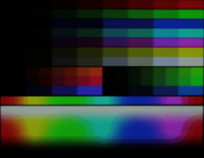
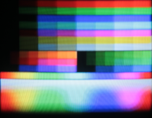

# NTSC Color

## Gamut conversion
As of 2022-03-16, various sources of documentation and code have little information except the technical aspects of the signal and of YIQ to/from sRGB conversion.

Therefore, determining the colors through reverse engineering is necessary:

Take a picture of a BENQ monitor and a JVC TV (defaults), and compare the results as follows.

LED Monitor:
- Brand: BENQ
- Model: GW2480

CRT TV:
- Brand: JVC
- Model: AV-27890
- Settings: defaults
- Warmup time:
  - full-size image: around 5 minutes
  - TV-safe (smaller) image (ISO 100 used but some 200 on camera as labeled): around 3.5 hours.
- Played on DVD player (See the "Test Image" section for how converted to DVD):
  Magnavox DV225MG9 A (2011 VHS-DVD combo)

Camera & Settings:
- Canon DS126271
- Mode: Manual
- 1/8 F5.6
- Zoom: full (EF-S 18-55mm f/3.5-5.6 IS Lens)
- ISO: 200
- Color Balance: Faithful

Test Image:\
\
*CC0 Ricardo Cancho Niemietz on wikimedia.org*
- converted to VOB using (NTSC DVD 4:3 preset)
- converted to DVD using DVDStyler

LCD Photo (ISO 100):\

CRT Photo (ISO 100):\

Processing:
- Since converting the old image to the monitor image is the goal, clamp the monitor image then clamp the TV image by the same amount first.
- Determine how much reference colors need to change to become the destination image's:
  - black point
  - white point
- Aberrations in measurements (in csv files):
  - Some colors can't be displayed on a CRT, so they (colors on the far left) disappear into pseudo-black colors that don't have the same hue as specified.
  - ISO 200 version
    - Some samples clip to 255.
    - Scanlines, even after downscaled to 600x462, appear, so GIMP sample radius may have a slightly weighted average toward the brighter or darker line.
